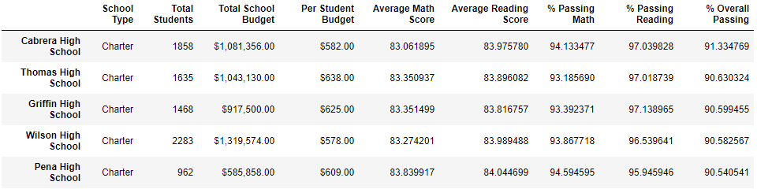
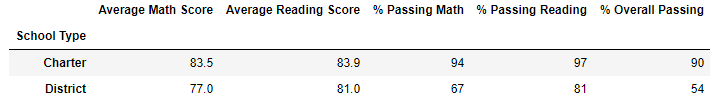

# School District Analysis

## School District Analysis Overview

This project utilized the Pandas library and Jupyter Notebooks in Python to perform analysis for a city school district. Raw data contained in CSV files was imported, and Pandas data frames were created to perform comparitive analysis. The initial analysis involved cleaning the data and performing comparitive analysis on reading and math scores for 15 different high schools. The analysis investigated reading and math performance based on grade level, funding amount, school size, and school type. Following the initial analysis, it was determined that academic dishonesty had occured, and all 9th grade scores for Thomas High School were invalid. The analysis presented in this report outlines the impact of this academic dishonesty on the overall data. The code for this analysis was developed in Jupyter Notebooks using Python version 3.8.8.

### School District Analysis Purpose

The overall purpose of this project was to gain familiarity with the Pandas library and Jupyter Notebooks to perform real-world data analysis. The analysis was designed to assist a school district determine high school student performance based on a variety of factors. This information could be used in the future to help the school district allocate funds, provide additional resources to certain schools, or rezone the district. This module continued to build upon knowledge gained in previous modules to develop skills in data analysis.

## School District Analysis Results

In order to account for the academic dishonesty resulting in invalid scores for 9th grade students at Thomas High School, the reading and math scores were set to NaN. The code and a portion of the updated data frame are shown below in Figs. 1 and 2.

*Figure 1. Python code to change 9th grade math and reading scores for Thomas High School students to 'NaN'*

*Figure 2. Resulting data frame after Thomas High School 9th grade scores were replaced with 'NaN'*

Following the data manipulation illustrated in Figs. 1 and 2, the comparitive analysis outlined above was repeated to find average reading and math scores along with the passing percentages for reading and math with scores for 9th graders at Thomas High School removed from the dataset.

A summary of the findings from this analysis is given below.

- The district summary experienced little impact due to the removal of Thomas High School 9th grade math and reading scores. The average math score for the district decreased from 79 to 78.9, and the average reading score remained unchanged at 81.9. There was no change in the percentages of students passing math and reading, and no change the percentage of students passing overall (passing both math and reading). These results are summarized in Figs. 3 and 4, where Fig. 3 illustrates the district summary with the original 9th grade student scores, and Fig. 4 illustrates the district summary with the 9th grade scores for Thomas High School replaced with 'NaN'.

    
    
    *Figure 3. District summary with original Thomas High School 9th grade scores*

    
    
    *Figure 4. District summary with Thomas High School 9th grade scores replaced with 'NaN'*

- The per-school summary with the original 9th grade scores for Thomas High is shown in Fig. 5. To correctly compute the passing percentages for Thomas High School, only the 10th-12th grade students were considered. Because the 9th grade scores were set to 'NaN', including this data would have erroneously reduced the passing percentages for Thomas High School. These 'NaN' values would have been included in the total count, but they could not have contributed to the total number of passing scores. As there is no way to know the actual grades for 9th grade students at Thomas High School, we cannot determine whether or not each student had a passing grade. Therefore, the 'NaN' grades were removed. The school summary with the 9th grade scores for Thomas High removed is shown in Fig. 6. There were small changes in the average math and reading scores for Thomas High, and there were small changes in the percentages of passing students. The average math score decreased from 83.42 to 83.35, and the average reading score increased from 83.85 to 83.90. The percentage of students passing math decreased from 93.27% to 93.19%, the percentage of students passing reading decreased from 97.31% to 97.02%, and the percentage of students passing overall decreased from 90.95% to 90.63%.

    
    
    *Figure 5. Per-school summary with original Thomas High School 9th grade scores*

    
    
    *Figure 6. Per-school summary with Thomas High School 9th grade scores removed*

- As expected from the small changes in average scores and passing percentages, the overall ranking for Thomas High School remained unchanged as indicated by the top five performing schools in the district shown in Figs. 7 and 8. Fig. 7 illustrates the top five performing schools with the data that included the original 9th grade Thomas High School scores, and Fig. 8 illustrates the top five performing schools with the 9th grade scores for Thomas High School removed.

    
    
    *Figure 7. Top five performing schools with original Thomas High School 9th grade scores*

    
    
    *Figure 8. Top five performing schools with Thomas High School 9th grade scores removed*

- Replacing the 9th grade scores at Thomas High with 'NaN' had little impact overall on the analysis. The average scores for Thomas High School saw little change with the 9th grade scores remove, and the 'NaN' scores were removed from percentages of students passing math and reading. The impacts of removing the Thomas High School 9th grade scores on the analysis are illustrated below with screen shots of the data frames.

    - The only impact to the breakdown of math and reading scores by grade were the 'nan' scores for Thomas High School 9th graders as shown in Figs. 9-12 below. Unfortunately, this makes it impossible to directly compare 9th grade student performance at Thomas High School with that of other high schools in the district. 
    
        
        
        *Figure 9. Math scores by grade with original Thomas High School 9th grade scores*

        
        
        *Figure 10. Reading scores by grade with original Thomas High School 9th grade scores*

        
        
        *Figure 11. Math scores by grade with Thomas High School 9th grade scores removed*

        
        
        *Figure 12. Reading scores by grade with Thomas High School 9th grade scores removed*

    - There was no impact on scores broken down by school spending as shown in Figs. 13 and 14.

        
        
        *Figure 13. Scores by school spending with original Thomas High School 9th grade scores*

        
        
        *Figure 14. Scores by school spending with Thomas High School 9th grade scores removed*

    - There was no impact on scores broken down by school size as shown in Figs. 15 and 16.

        
        
        *Figure 15. Scores by school size with original Thomas High School 9th grade scores*

        
        
        *Figure 16. Scores by school size with Thomas High School 9th grade scores removed*

    - There was no impact on scores broken down by school type as shown in Figs. 17 and 18.

        
        
        *Figure 17. Scores by school type with original Thomas High School 9th grade scores*

        
        
        *Figure 18. Scores by school type with Thomas High School 9th grade scores removed*

## School District Analysis Summary

The four major changes on the updated school district analysis after reading and math scores were replaced with 'NaN' are summarized below.

1. The total student count had to be modified in order to correctly compute the passing percentages for the district. This was accomplished with a *new_student_count* variable calculated by subtracting the number of 9th graders at Thomas High School from the total student count. The code to find the number of 9th graders at Thomas High School is shown in Fig. 19.

*Figure 19. Python code to find the new student count excluding 9th graders at Thomas High School*

2. After generating the new student count that excluded Thomas High School 9th graders, the passing percentages for the district had to be recomputed using the new student count. The code to compute the new passing percentages is shown in Fig. 20.

*Figure 20. Python code to correct district data excluding 9th graders at Thomas High School*

3. To correctly generate the per-school information, the data for Thomas High School had to be modified to only include 10th-12th grade students as 9th grade students had no valid grades. The number of 10th-12th grade students were found, new data specifically for Thomas High School was computed, and this data replaced the previous Thomas High School in the school summary data frame. The code to complete this part of the analysis is shown in Fig. 21.

*Figure 21. Python code to correct school summary data including only 10th-12th graders at Thomas High School*

4. Unfortunately, with 9th grade scores for Thomas High School Students invalidated, there is no way to compare 9th grade performance at Thomas High School with that of other schools in the district. This was illustrated previously in the report with Figs. 11 and 12 where the 9th grade reading and math scores show 'nan' for Thomas High School. This had little impact on the overall comparison of Thomas High School with other schools in the district including data for all grades, but if 9th grade performance specifically was compared, there would be no way to see where Thomas High School measures against other high schools.
